# Crow Hub - System Architecture

> A high-performance AI Agent Orchestration Hub built in Rust.
> Universal middleware for multi-agent communication, scheduling, memory, and monitoring.

## 1. High-Level Overview

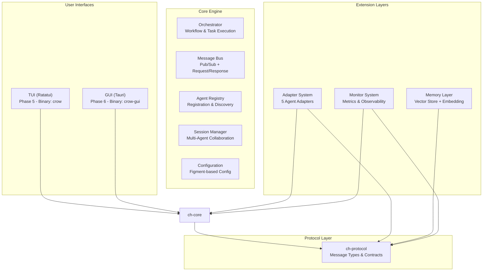

## 2. Workspace Crate Dependency Graph

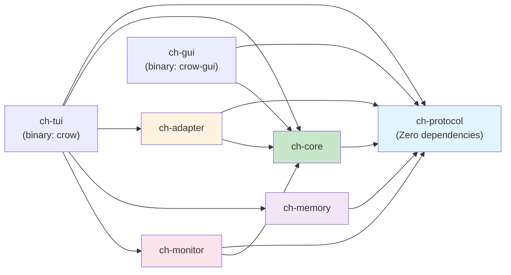

## 3. Crate Inventory

| Crate | Type | Binary | Purpose | Phase |
|-------|------|--------|---------|-------|
| `ch-protocol` | library | - | Core message types & communication protocol | Phase 1 |
| `ch-core` | library | - | Message bus, agent registry, session manager, orchestrator | Phase 1 |
| `ch-adapter` | library | - | Unified adapter trait + 5 adapter implementations | Phase 2 |
| `ch-memory` | library | - | Pluggable vector memory with semantic search | Phase 3 |
| `ch-monitor` | library | - | Token usage, performance, resource monitoring | Phase 4 |
| `ch-tui` | binary | `crow` | Terminal UI with Ratatui + Clap CLI | Phase 5 |
| `ch-gui` | binary | `crow-gui` | Desktop GUI with Tauri (placeholder) | Phase 6 |

## 4. Core Types (ch-protocol)

This is the foundation layer with zero internal crate dependencies.

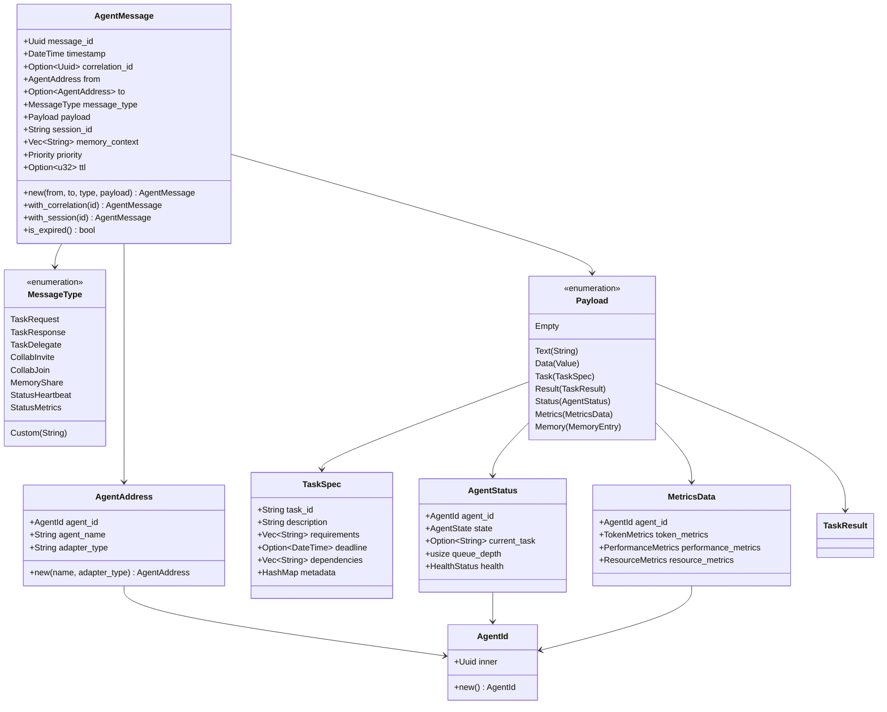

## 5. Core Engine (ch-core)

### 5.1 CrowHub - Main Entry Point

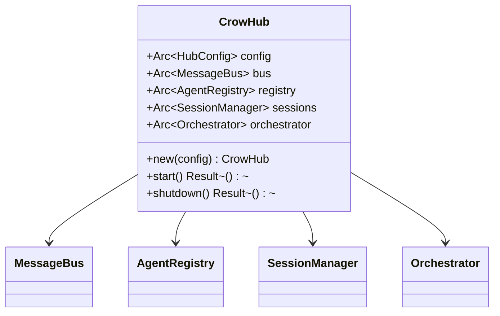

### 5.2 Message Bus

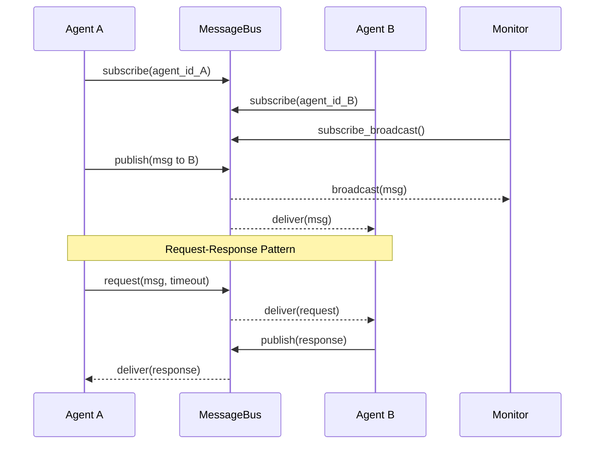

### 5.3 Orchestrator - Workflow Execution

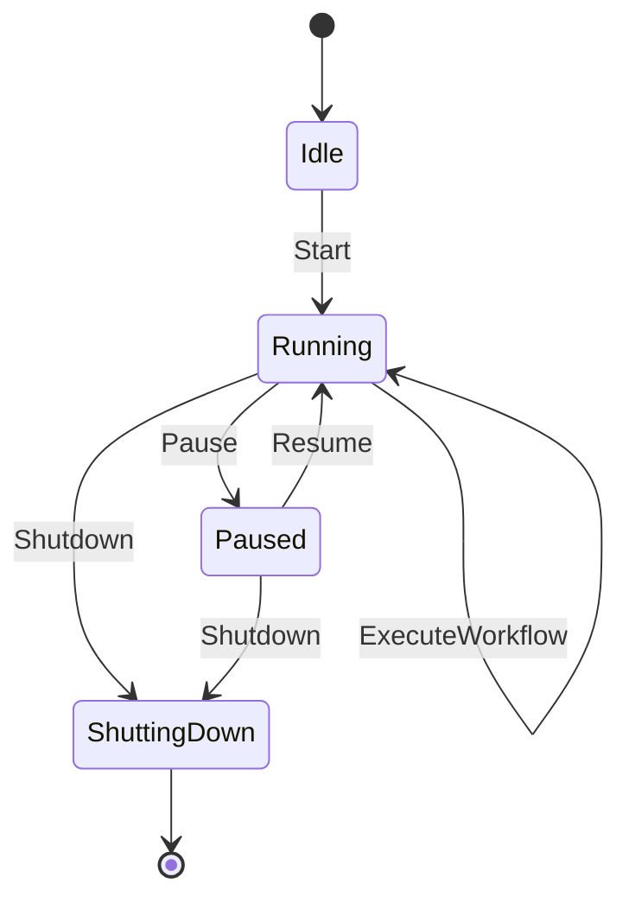

## 6. Adapter System (ch-adapter)

### 6.1 Adapter Trait

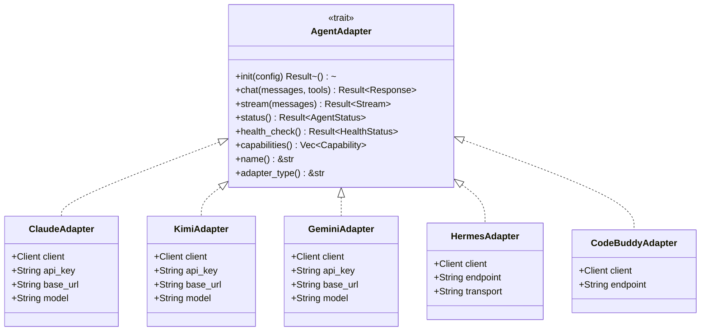

### 6.2 Adapter Factory Pattern

```mermaid
flowchart LR
    Client["Client Code"] -->|create("claude")| Factory["AdapterFactory"]
    Factory -->|Box<dyn AgentAdapter>| Claude["ClaudeAdapter"]
    Factory -->|Box<dyn AgentAdapter>| Kimi["KimiAdapter"]
    Factory -->|Box<dyn AgentAdapter>| Gemini["GeminiAdapter"]
    Factory -->|Box<dyn AgentAdapter>| Hermes["HermesAdapter"]
    Factory -->|Box<dyn AgentAdapter>| CodeBuddy["CodeBuddyAdapter"]
```

## 7. Memory Layer (ch-memory)

### 7.1 Memory Store Architecture

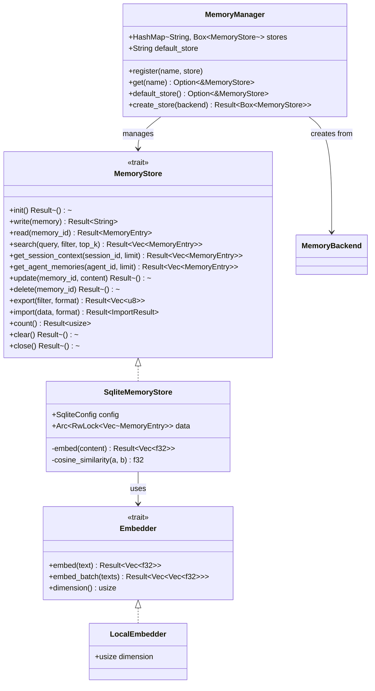

### 7.2 Supported Backends

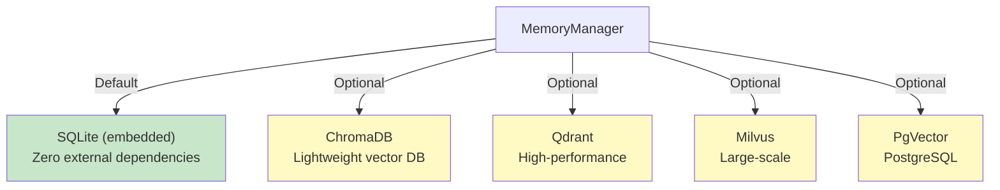

## 8. Monitor System (ch-monitor)

### 8.1 Metrics Collection Pipeline

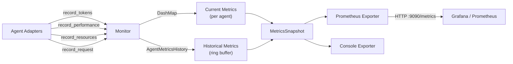

### 8.2 Metrics Hierarchy

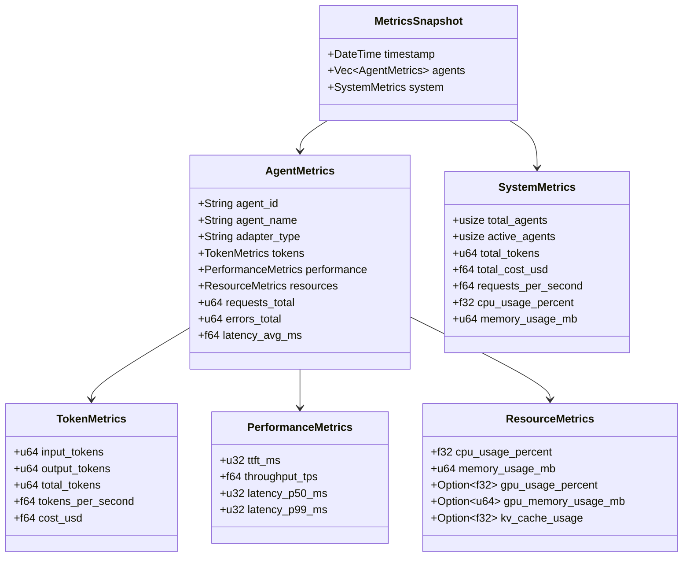

## 9. Session Management

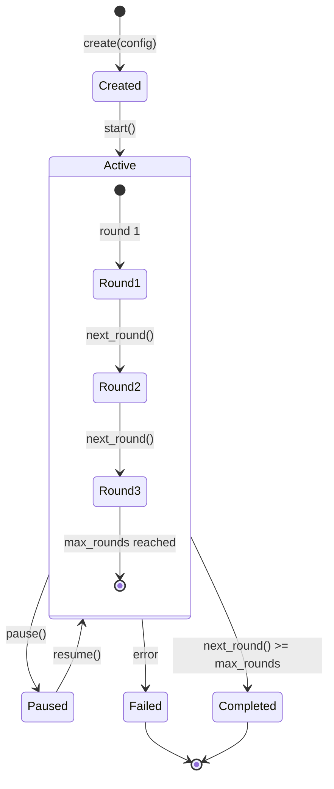

## 10. Development Roadmap

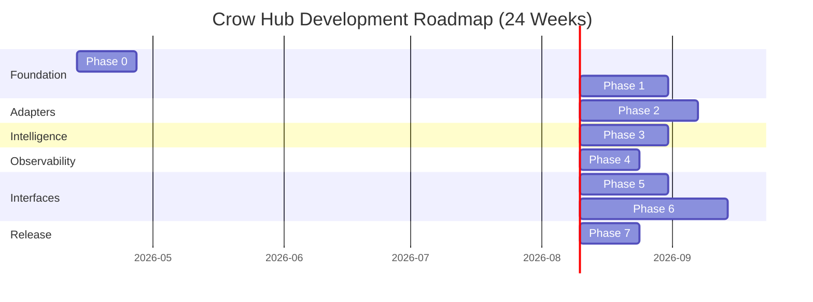

## 11. Technology Stack

| Component | Technology | Purpose |
|-----------|-----------|---------|
| Language | Rust 1.86+ | Safety, performance, concurrency |
| Async Runtime | Tokio | Event-driven I/O |
| Serialization | Serde + JSON | Message serialization |
| HTTP Client | Reqwest | API calls to agents |
| gRPC | Tonic | Future inter-process communication |
| Configuration | Figment | Multi-source config (TOML + ENV) |
| CLI | Clap v4 | Command-line argument parsing |
| Logging | Tracing | Structured logging & observability |
| Error Handling | thiserror + anyhow | Typed errors + flexible errors |
| Concurrency | DashMap + parking_lot | Lock-free concurrent maps |
| TUI Framework | Ratatui | Terminal user interface |
| GUI Framework | Tauri | Cross-platform desktop GUI |
| Testing | Mockall + tokio-test | Mocking & async testing |

## 12. Key Design Decisions

1. **Protocol-first design**: `ch-protocol` has zero internal dependencies, ensuring all crates share the same message contracts.
2. **Trait-based extensibility**: `AgentAdapter`, `MemoryStore`, `Collector`, `Exporter` traits enable hot-pluggable implementations.
3. **DashMap for concurrency**: Lock-free concurrent maps avoid global locks for agent registry and metrics.
4. **Broadcast + direct delivery**: Message bus uses broadcast channel for monitors and direct mpsc for targeted delivery.
5. **Local-first memory**: Default SQLite backend with local embedding model requires zero external services.
6. **Factory pattern for adapters**: `AdapterFactory` provides runtime adapter selection by type string.
